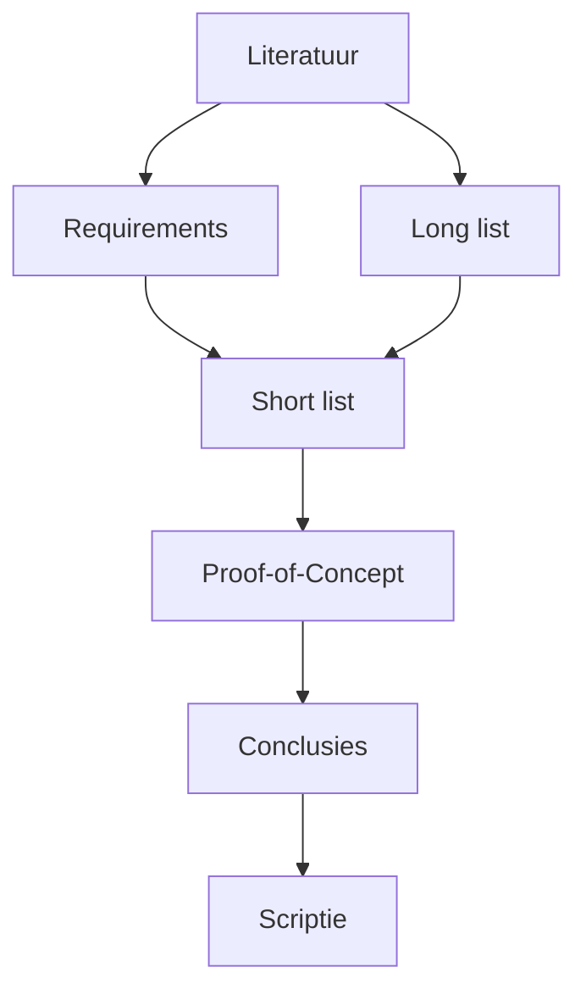
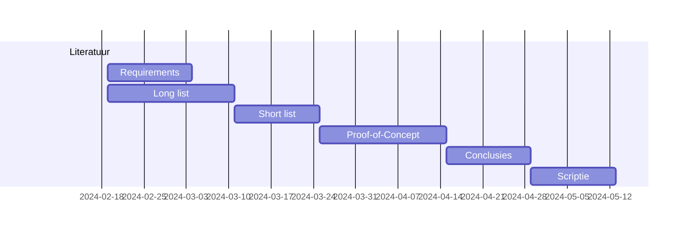

# Fase 5. Methodologie.

- Schrijf een plan van aanpak uit voor het verloop van je bachelorproef in de sectie Methodologie van de paper.

- Verdeel het proces op in verschillende fasen en beschrijf concreet wat je in elke fase gaat doen, waarom en wat het resultaat moet zijn (deliverables). Vermijd vage beschrijvingen zoals "onderzoeken", "onderzoek voeren", maar probeer zo concreet mogelijk te zijn!

    - Bij een literatuurstudie, bv., wat ga je precies opzoeken? Algemene info over het onderwerp (geef enkele zoektermen of specifieke topics waar je naar gaat zoeken), een lijst samenstellen van alle mogelijke tools/frameworks/... die je kan gebruiken om een oplossing te bouwen voor het probleem (long list), opzoeken wat de actuele aanpak is van dit soort problemen, welk onderzoek er al gebeurd is binnen dit domein, ...

    - Als je een vergelijkende studie gaat uitvoeren, schrijf dan ook de verschillende fasen volledig uit: beschrijving casus (huidige toestand, AS IS), requirement-analyse (TO BE), long list, short list, enz.

    - Als je een experiment gaat uitvoeren, beschrijf dan de opstelling en welke data je precies gaat verzamelen.

    - Beschrijf ook het eindresultaat of deliverable van elke fase. Welk tastbaar resultaat heeft elke fase? Dat kan bv. een samenvatting zijn van de vakliteratuur, een lijst met requirements gestructureerd volgens de MoSCoW-methode, een proefopstelling bestaande uit virtuele machines, enz.

- Probeer een timing uit te denken voor elke fase. Een normaal tijdverloop van de bachelorproef is starten bij het begin van semester 2 en indienen op vrijdag van de eerste examenweek.

    - Het is wellicht nuttig in termen van weken te denken. Hou er rekening mee dat je in het modeltraject typisch 4 weekdagen aan je stage besteedt en 1 dag aan je BP.

- Visualiseer het plan van aanpak met een flowchart of Gantt-diagram.

    Je kan flowcharts, Gantt- of andere diagrammen in Mardown bewerken via [Mermaid](https://mermaid.js.org). In VS Code kan je hiervoor de [Markdown Preview Mermaid Support](https://marketplace.visualstudio.com/items?itemName=bierner.markdown-mermaid) installeren.

    Als je de afbeelding wilt gebruiken in je voorstel, kan je zoeken naar een tool om de code om te zetten in afbeeldingen, of je kan in de Preview een screenshot maken en die opslaan. De VS Code plugin [Markdown PDF Export](https://marketplace.visualstudio.com/items?itemName=yzane.markdown-pdf) converteert ook Mermaid-diagrammen correct.

## Voorbeelden

Met een flowchart kan je de afhankelijkheden tussen fasen visualiseren

Een Gantt-chart toont ook hoe je de verschillende fasen in de tijd gaat inplannen. Hier zie je ook dat sommige fasen kunnen overlappen (zoals hier de literatuurstudie) of parallel lopen.

