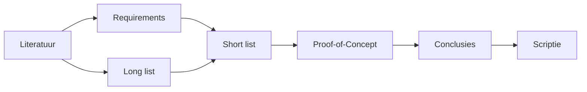
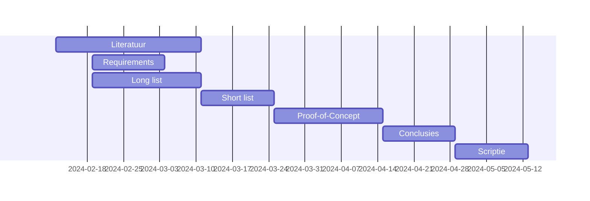

# Fase 5. Methodologie.

- Schrijf een plan van aanpak uit voor het verloop van je bachelorproef in de sectie Methodologie van de paper.

- Verdeel het proces op in verschillende fasen en beschrijf concreet wat je in elke fase gaat doen, waarom en wat het resultaat moet zijn (deliverables). Vermijd vage beschrijvingen zoals "onderzoeken", "onderzoek voeren", maar probeer zo concreet mogelijk te zijn!

    - Bij een literatuurstudie, bv., wat ga je precies opzoeken? Algemene info over het onderwerp (geef enkele zoektermen of specifieke topics waar je naar gaat zoeken), een lijst samenstellen van alle mogelijke tools/frameworks/... die je kan gebruiken om een oplossing te bouwen voor het probleem (long list), opzoeken wat de actuele aanpak is van dit soort problemen, welk onderzoek er al gebeurd is binnen dit domein, ...

    - Als je een vergelijkende studie gaat uitvoeren, schrijf dan ook de verschillende fasen volledig uit: beschrijving casus (huidige toestand, AS IS), requirement-analyse (TO BE), long list, short list, enz.

    - Als je een experiment gaat uitvoeren, beschrijf dan de opstelling en welke data je precies gaat verzamelen.

    - Beschrijf ook het eindresultaat of **deliverable** van elke fase. Welk tastbaar resultaat heeft elke fase? Dat kan bv. een samenvatting zijn van de vakliteratuur, een lijst met requirements gestructureerd volgens de MoSCoW-methode, een proefopstelling bestaande uit virtuele machines, enz.

    - Vermijd het "watervalmodel", maar hanteer een iteratieve aanpak.

    - Als je aan ChatGPT vraagt om je methodologie uit te schrijven zal het resultaat een vage woordenbrij zonder inhoud zijn en dus totaal onbruikbaar (en bovendien leiden tot een 0 voor de paper). Schrijf de tekst dus zelf!

- Probeer een timing uit te denken voor elke fase/deliverable. Geef jezelf een concrete deadline voor elke deliverable.

    - Een aantal deadlines worden al vastgelegd. In de veronderstelling dat je deelneemt aan de BP als jaarvak, zijn dat:

        - Einde lesweek 12 (sem 1): indienen onderzoeksvoorstel

        - Einde lesweek 1 (sem2): verbeterd onderzoeksvoorstel indienen (na feedback door promotor)

        - Einde lesweek 6: draftversie literatuuroverzicht

        - Einde lesweek 11: draftversie bachelorproef

        - Einde lesweek 13: finale versie bachelorproef

    - Let op bij het beschrijven van hoe lang een fase zou duren en wees daar heel duidelijk in. Hou er rekening mee dat je in het modeltraject typisch 4 weekdagen aan je stage besteedt en 1 dag aan je BP.

        - Als je bv schrijft dat je "1 week" werkt aan een fase, betekent dat dan 1 werkdag of 5 werkdagen verspreid over 5 weken? Of ga je ook in het weekend werken?

        - Voorzie voldoende tijd voor de belangrijkste fasen in het onderzoek, zoals het implementeren van een PoC en het uitvoeren van experimenten.

- Visualiseer het plan van aanpak met een flowchart of Gantt-diagram.

    Je kan flowcharts, Gantt- of andere diagrammen in Mardown bewerken via [Mermaid](https://mermaid.js.org). In VS Code kan je hiervoor de [Markdown Preview Mermaid Support](https://marketplace.visualstudio.com/items?itemName=bierner.markdown-mermaid) installeren.

    Als je de afbeelding wilt gebruiken in je voorstel, kan je zoeken naar een tool om de code om te zetten in afbeeldingen, of je kan in de Preview een screenshot maken en die opslaan. De VS Code plugin [Markdown PDF Export](https://marketplace.visualstudio.com/items?itemName=yzane.markdown-pdf) converteert ook Mermaid-diagrammen correct. **Neem screenshots in light mode!** In dark mode is de tekst moeilijker leesbaar en dit past ook qua stijl niet de rest van het document.

## Voorbeelden

Met een [flowchart](https://mermaid.js.org/syntax/flowchart.html) kan je de afhankelijkheden tussen fasen visualiseren

Een [Gantt-chart](https://mermaid.js.org/syntax/gantt.html) toont ook hoe je de verschillende fasen in de tijd gaat inplannen. Hier zie je ook dat sommige fasen kunnen overlappen (zoals hier de literatuurstudie) of parallel lopen.

**Opmerking:** Dit zijn zeer vereenvoudigde voorbeelden. We verwachten dat je deze zelf opmaakt specifiek voor je eigen methodologie. In de Gantt-chart zijn bijvoorbeeld geen milestones (deliverables) opgenomen en die kan je best toevoegen.

## Checklist

- [ ] Het onderzoek is opgesplitst in verschillende fasen
- [ ] Voor elke fase is er een:
    - Concrete *deliverable* (bv. een specifiek hoofdstuk van de bachelorproeftekst, een werkende proefopstelling, ...)
    - *Deadline*
    - *Concrete* beschrijving van wat je gaat doen
- [ ] Het verloop van de fasen wordt gevisualiseerd ahv een flow- en/of Gantt-chart
    - Fasen komen overeen met de beschrijving in de methodologie
    - Gantt-chart bevat tussentijdse deadlines/milestones